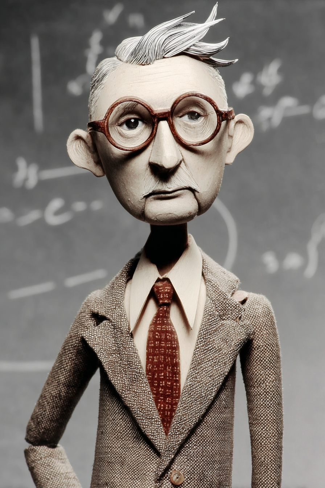
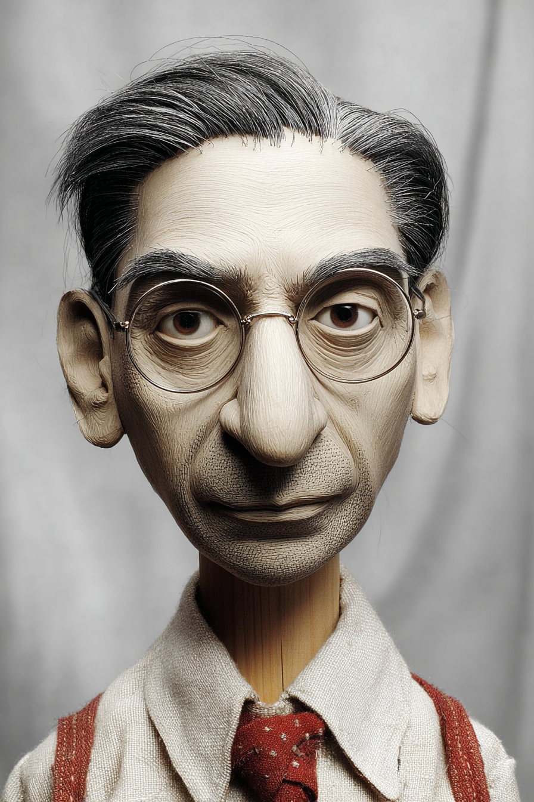

# Living Models — Wayback Sections

> Extracted from `chapters/`. Each entry corresponds to one chapter file.
> Sections are instructor-authored. Missing sections show a placeholder only.
> Do not edit this file directly — edit the source chapter file, then re-run extraction.

---

## Chapter 00: Living Models
*Source: `chapters/00-frontmatter.md`*

> **Section not yet authored.** No `## AI Wayback Machine` block found in this chapter file.
> To add this section, edit the source chapter file directly.

---

## Chapter 00: Introduction
*Source: `chapters/00-introduction.md`*

> **Section not yet authored.** No `## AI Wayback Machine` block found in this chapter file.
> To add this section, edit the source chapter file directly.

---

## Chapter 01: Chapter 1 — The Dashboard That Lied
*Source: `chapters/01-the-dashboard-that-lied.md`*

## AI Wayback Machine

The ideas in this chapter didn't appear from nowhere. **John Snow** was mapping cholera deaths to street addresses to expose what the prevailing miasma dashboards could not see decades before most people had heard of the silent failure of an analytical system that confidently reports the wrong thing. Here's a prompt to find out more — and then make it better.


*John Snow, c. 1850s. AI-generated portrait based on a public domain photograph.*


*Puppet Art by [Nik Bear Brown](https://www.nikbearbrown.com/).*

**Run this:**

```
Who was John Snow, and how does his 1854 cholera map connect to the chapter's claim that an analytical dashboard can confidently report the wrong thing while every error signal stays silent? Keep it to three paragraphs. End with the single most surprising thing about his career or ideas.
```

→ Search **"John Snow physician"** on Wikipedia after you run this. See what the model got right, got wrong, or left out.

**Now make the prompt better.** Try one of these:

- Ask it to explain *spot-mapping* in plain language, as if you've never read epidemiology
- Ask it to compare Snow's Broad Street pump argument to a modern dashboard that conflates association with intervention
- Add a constraint: "Answer as if you're writing the executive summary of a post-mortem on a silent-failure incident"

What changes? What gets better? What gets worse?

---

## Chapter 02: Chapter 2 — The Map That Doesn't Move
*Source: `chapters/02-the-map-that-doesnt-move.md`*

## AI Wayback Machine

The ideas in this chapter didn't appear from nowhere. **Trygve Haavelmo** was publishing *The Probability Approach in Econometrics* in 1944 to argue that observational econometric models cannot, by themselves, support claims about deliberate intervention decades before most people had heard of predictive models breaking under intervention. Here's a prompt to find out more — and then make it better.


*Trygve Haavelmo, c. 1950s. AI-generated portrait based on a public domain photograph.*

**Run this:**

```
Who was Trygve Haavelmo, and how does his 1944 distinction between observational fit and intervention-supporting structure connect to why predictive models break when used to recommend deliberate action? Keep it to three paragraphs. End with the single most surprising thing about his career or ideas.
```

→ Search **"Trygve Haavelmo"** on Wikipedia after you run this. See what the model got right, got wrong, or left out.

**Now make the prompt better.** Try one of these:

- Ask it to explain the *autonomy of structural equations* in plain language, as if you've never seen an economic model
- Ask it to compare Haavelmo's structural-vs-reduced-form distinction to today's predictive-vs-causal model debate
- Add a constraint: "Answer as if you're writing the warning label on a forecast that will be used to set policy"

What changes? What gets better? What gets worse?

---

## Chapter 03: Chapter 3 — What We Mean When We Say "Real-Time"
*Source: `chapters/03-what-we-mean-when-we-say-realtime.md`*

## AI Wayback Machine

The ideas in this chapter didn't appear from nowhere. **Konrad Zuse** was designing the Z3 in 1941 — the first programmable, fully automatic digital computer — under conditions where every notion of *real-time* had to be invented from scratch decades before most people had heard of the three latencies hiding inside any 'real-time' claim. Here's a prompt to find out more — and then make it better.


*Konrad Zuse, c. 1940s. AI-generated portrait based on a public domain photograph.*

**Run this:**

```
Who was Konrad Zuse, and how do the design choices in the Z3 (1941) and the Plankalkül connect to the chapter's argument that *real-time* is three independent latencies — data, model, and decision — not one? Keep it to three paragraphs. End with the single most surprising thing about his career or ideas.
```

→ Search **"Konrad Zuse"** on Wikipedia after you run this. See what the model got right, got wrong, or left out.

**Now make the prompt better.** Try one of these:

- Ask it to explain *Plankalkül* in plain language, as if you've never seen a programming language
- Ask it to compare Zuse's hand-built relay timing to the data / model / decision latencies named in this chapter
- Add a constraint: "Answer as if you're auditing a vendor's claim that their system is real-time"

What changes? What gets better? What gets worse?

---

## Chapter 04: Chapter 4 — Risk Is Two Numbers, Not One
*Source: `chapters/04-risk-is-two-numbers-not-one.md`*

## AI Wayback Machine

The ideas in this chapter didn't appear from nowhere. **Frank Knight** was drawing the foundational distinction between *measurable risk* and *Knightian uncertainty* in *Risk, Uncertainty and Profit* (1921) decades before most people had heard of probability and impact as two independent numbers, not one. Here's a prompt to find out more — and then make it better.


*Frank Knight, c. 1930s. AI-generated portrait based on a public domain photograph.*

**Run this:**

```
Who was Frank Knight, and how does his 1921 distinction between measurable risk and Knightian uncertainty connect to the chapter's argument that collapsing probability and impact into a single risk score destroys the information a decision requires? Keep it to three paragraphs. End with the single most surprising thing about his career or ideas.
```

→ Search **"Frank Knight economist"** on Wikipedia after you run this. See what the model got right, got wrong, or left out.

**Now make the prompt better.** Try one of these:

- Ask it to explain *Knightian uncertainty* in plain language, as if you've never taken an economics course
- Ask it to compare Knight's distinction to what a heat-map collapse hides about a tail risk
- Add a constraint: "Answer as if you're writing the case against COSO ERM-style heat maps for a board"

What changes? What gets better? What gets worse?

---

## Chapter 05: Chapter 5 — Pearl's Ladder
*Source: `chapters/05-pearls-ladder.md`*

## AI Wayback Machine

The ideas in this chapter didn't appear from nowhere. **Karl Pearson** was arguing in *The Grammar of Science* (1892) that *all science is description of association* — the position Pearl's Ladder is, structurally, a refutation of decades before most people had heard of the categorical distinction between association, intervention, and counterfactual. Here's a prompt to find out more — and then make it better.


*Karl Pearson, c. 1890s. AI-generated portrait based on a public domain photograph.*

**Run this:**

```
Who was Karl Pearson, and how does his program — that science consists of describing associations, not mechanisms — connect, by contrast, to Pearl's argument that observational data alone cannot answer interventional questions? Keep it to three paragraphs. End with the single most surprising thing about his career or ideas.
```

→ Search **"Karl Pearson"** on Wikipedia after you run this. See what the model got right, got wrong, or left out.

**Now make the prompt better.** Try one of these:

- Ask it to explain why *correlation is not causation* was once a contested rather than obvious claim, in plain language
- Ask it to compare Pearson's correlationist program to Pearl's Rung 1 / Rung 2 distinction
- Add a constraint: "Answer as if you're writing the historical preface to a chapter on the do-operator"

What changes? What gets better? What gets worse?

---

## Chapter 06: Chapter 6 — Graphs That Think
*Source: `chapters/06-graphs-that-think.md`*

## AI Wayback Machine

The ideas in this chapter didn't appear from nowhere. **Sewall Wright** was inventing *path analysis* in 1918 — the diagrammatic method whose path coefficients are the direct ancestor of every directed acyclic graph in this book decades before most people had heard of DAGs as maps of mechanism. Here's a prompt to find out more — and then make it better.


*Sewall Wright, c. 1920s. AI-generated portrait based on a public domain photograph.*



*Puppet Art by [Nik Bear Brown](https://www.nikbearbrown.com/).*

**Run this:**

```
Who was Sewall Wright, and how does his 1918 invention of path analysis — and the long debate it provoked with R. A. Fisher and Karl Pearson — connect to the chapter's argument that a DAG is a map of mechanism, not a picture of correlations? Keep it to three paragraphs. End with the single most surprising thing about his career or ideas.
```

→ Search **"Sewall Wright"** on Wikipedia after you run this. See what the model got right, got wrong, or left out.

**Now make the prompt better.** Try one of these:

- Ask it to explain *path coefficients* in plain language, as if you've only ever seen regression coefficients
- Ask it to compare Wright's path diagrams (1918) to the modern DAGs in this chapter
- Add a constraint: "Answer as if you're writing the rationale for using a DAG instead of a regression equation in a board memo"

What changes? What gets better? What gets worse?

---

## Chapter 07: Chapter 7 — The Equivalence Problem
*Source: `chapters/07-the-equivalence-problem.md`*

## AI Wayback Machine

The ideas in this chapter didn't appear from nowhere. **Bertrand Russell** was arguing in *On the Notion of Cause* (1913) that observational data could not, in principle, distinguish A→B from B→A from a common cause — the philosophical anticipation of what Markov equivalence formalizes decades before most people had heard of Markov equivalence and the necessity of expert input. Here's a prompt to find out more — and then make it better.


*Bertrand Russell, c. 1910s. AI-generated portrait based on a public domain photograph.*

**Run this:**

```
Who was Bertrand Russell, and how does his 1913 essay *On the Notion of Cause* — arguing that observation cannot distinguish causal direction from common-cause explanations — connect to the chapter's claim that Markov-equivalence makes expert input mathematically necessary, not merely useful? Keep it to three paragraphs. End with the single most surprising thing about his career or ideas.
```

→ Search **"Bertrand Russell"** on Wikipedia after you run this. See what the model got right, got wrong, or left out.

**Now make the prompt better.** Try one of these:

- Ask it to explain why Russell wanted to *eliminate* the notion of cause from physics, in plain language
- Ask it to compare Russell's 1913 critique to the formal Markov-equivalence theorem proved decades later
- Add a constraint: "Answer as if you're writing the introduction to a chapter on why DAGs require domain experts"

What changes? What gets better? What gets worse?

---

## Chapter 08: Chapter 8 — Estimating Effects
*Source: `chapters/08-estimating-effects.md`*

## AI Wayback Machine

The ideas in this chapter didn't appear from nowhere. **Gertrude Cox** was co-authoring *Experimental Designs* (1950, with William Cochran) — the foundational textbook on factorial experiments and adjustment for confounding that the modern backdoor and DML estimators inherit from decades before most people had heard of the backdoor criterion and the deconfounded effect estimate. Here's a prompt to find out more — and then make it better.


*Gertrude Cox, c. 1940s. AI-generated portrait based on a public domain photograph.*

**Run this:**

```
Who was Gertrude Cox, and how does her work on experimental design and statistical adjustment connect to the modern apparatus of the backdoor criterion and double machine learning for estimating causal effects from observational data? Keep it to three paragraphs. End with the single most surprising thing about her career or ideas.
```

→ Search **"Gertrude Cox"** on Wikipedia after you run this. See what the model got right, got wrong, or left out.

**Now make the prompt better.** Try one of these:

- Ask it to explain *adjustment for confounding* in plain language, as if you've never run a regression
- Ask it to compare Cox's hand-tabulated factorial designs to a modern double-machine-learning pipeline
- Add a constraint: "Answer as if you're writing the introduction to a chapter on identifying causal effects from observational data"

What changes? What gets better? What gets worse?

---

## Chapter 09: Chapter 9 — The Counterfactual
*Source: `chapters/09-the-counterfactual.md`*

## AI Wayback Machine

The ideas in this chapter didn't appear from nowhere. **Charles Sanders Peirce** was naming and developing the inferential move he called *abduction* — the same name Pearl gives to the first step of the abduction-action-prediction procedure decades before most people had heard of Pearl's abduction-action-prediction procedure for individual-level counterfactuals. Here's a prompt to find out more — and then make it better.


*Charles Sanders Peirce, c. 1890s. AI-generated portrait based on a public domain photograph.*

**Run this:**

```
Who was Charles Sanders Peirce, and how does his concept of *abduction* — the inference from a surprising observation to the hypothesis that would make it unsurprising — connect to the first step of Pearl's abduction-action-prediction procedure for computing individual-level counterfactuals? Keep it to three paragraphs. End with the single most surprising thing about his career or ideas.
```

→ Search **"Charles Sanders Peirce"** on Wikipedia after you run this. See what the model got right, got wrong, or left out.

**Now make the prompt better.** Try one of these:

- Ask it to explain Peirce's *abduction* in plain language, as if you've never read pragmatist philosophy
- Ask it to compare Peirce's three-step inference (abduction, deduction, induction) to Pearl's three-step counterfactual (abduction, action, prediction)
- Add a constraint: "Answer as if you're writing a footnote in a chapter on the but-for test"

What changes? What gets better? What gets worse?

---

## Chapter 10: Chapter 10 — Confounders, Colliders, and the Limits of Observational Data
*Source: `chapters/10-confounders-colliders-and-the-limits-of-observational-data.md`*

## AI Wayback Machine

The ideas in this chapter didn't appear from nowhere. **Jerome Cornfield** was deriving the bound that bears his name in 1959 — the original sensitivity analysis showing that an unmeasured confounder would have to be implausibly strong to overturn the observed association between smoking and lung cancer decades before most people had heard of the unconfoundedness assumption and how to bound the influence of latent confounders. Here's a prompt to find out more — and then make it better.


*Jerome Cornfield, c. 1960s. AI-generated portrait based on a public domain photograph.*

**Run this:**

```
Who was Jerome Cornfield, and how does his 1959 sensitivity bound — used to defend the smoking-cancer causal claim against tobacco-industry critics — connect to the chapter's E-value approach for stress-testing causal claims against unmeasured confounders? Keep it to three paragraphs. End with the single most surprising thing about his career or ideas.
```

→ Search **"Jerome Cornfield"** on Wikipedia after you run this. See what the model got right, got wrong, or left out.

**Now make the prompt better.** Try one of these:

- Ask it to explain *the Cornfield bound* in plain language, as if you've never seen a sensitivity analysis
- Ask it to compare Cornfield's 1959 reasoning about smoking and lung cancer to a modern E-value computed for a contemporary causal claim
- Add a constraint: "Answer as if you're writing the assumptions section of a model card"

What changes? What gets better? What gets worse?

---

## Chapter 11: Chapter 11 — Treatments
*Source: `chapters/11-treatments.md`*

## AI Wayback Machine

The ideas in this chapter didn't appear from nowhere. **Janet Lane-Claypon** was designing the first modern cohort and case-control studies in the 1910s and 1920s — the experimental templates that the RCT would refine and the SUTVA framework would later formalize decades before most people had heard of randomized controlled trials and the SUTVA assumption. Here's a prompt to find out more — and then make it better.


*Janet Lane-Claypon, c. 1920s. AI-generated portrait based on a public domain photograph.*

**Run this:**

```
Who was Janet Lane-Claypon, and how do her early-twentieth-century cohort and case-control study designs connect to the chapter's argument that randomization establishes causation where observational methods cannot — and to the SUTVA assumptions every trial silently makes? Keep it to three paragraphs. End with the single most surprising thing about her career or ideas.
```

→ Search **"Janet Lane-Claypon"** on Wikipedia after you run this. See what the model got right, got wrong, or left out.

**Now make the prompt better.** Try one of these:

- Ask it to explain *case-control design* in plain language, as if you've never seen an epidemiology textbook
- Ask it to compare Lane-Claypon's 1926 breast-cancer case-control study to a modern A/B test against the SUTVA criterion
- Add a constraint: "Answer as if you're writing the design rationale for an organizational intervention trial"

What changes? What gets better? What gets worse?

---

## Chapter 12: Chapter 12 — The Plumber's Objection
*Source: `chapters/12-the-plumbers-objection.md`*

## AI Wayback Machine

The ideas in this chapter didn't appear from nowhere. **Esther Boserup** was documenting in *The Conditions of Agricultural Growth* (1965) how interventions that look correct on paper run aground on the implementation realities of the populations they target decades before most people had heard of the gap between a correct causal estimate and an effective organizational change. Here's a prompt to find out more — and then make it better.


*Esther Boserup, c. 1960s. AI-generated portrait based on a public domain photograph.*

**Run this:**

```
Who was Esther Boserup, and how does her work on agricultural intensification — particularly her insistence on documenting how peasants actually responded to interventions, not how they were modeled to respond — connect to the chapter's argument that a clean causal estimate does not survive contact with the implementation cascade? Keep it to three paragraphs. End with the single most surprising thing about her career or ideas.
```

→ Search **"Esther Boserup"** on Wikipedia after you run this. See what the model got right, got wrong, or left out.

**Now make the prompt better.** Try one of these:

- Ask it to explain *induced intensification* in plain language, as if you've never read development economics
- Ask it to compare Boserup's field-level documentation of take-up to the *plumber* discipline this chapter teaches
- Add a constraint: "Answer as if you're writing the implementation section of a deployment plan"

What changes? What gets better? What gets worse?

---

## Chapter 13: Chapter 13 — The Living Model Defined
*Source: `chapters/13-the-living-model-defined.md`*

## AI Wayback Machine

The ideas in this chapter didn't appear from nowhere. **Kenneth Boulding** was publishing *General Systems Theory: The Skeleton of Science* in 1956 — the foundational case that a system is defined by the integrated operation of its properties, not by any property in isolation decades before most people had heard of the four properties of a Living Model operating together as one system. Here's a prompt to find out more — and then make it better.


*Kenneth Boulding, c. 1950s. AI-generated portrait based on a public domain photograph.*

**Run this:**

```
Who was Kenneth Boulding, and how does his 1956 *General Systems Theory* — the argument that systems are defined by integration across levels, not by any single property — connect to the chapter's claim that a Living Model's four properties (causal, counterfactual, continually updated, treatment-oriented) only deliver decision intelligence when they operate together? Keep it to three paragraphs. End with the single most surprising thing about his career or ideas.
```

→ Search **"Kenneth Boulding"** on Wikipedia after you run this. See what the model got right, got wrong, or left out.

**Now make the prompt better.** Try one of these:

- Ask it to explain Boulding's *hierarchy of systems* in plain language, as if you've never read systems theory
- Ask it to compare Boulding's integration argument to the orchestrated-outcomes claim in this chapter
- Add a constraint: "Answer as if you're writing the architectural rationale for why all four Living Model properties have to operate together"

What changes? What gets better? What gets worse?

---

## Chapter 14: Chapter 14 — The Expert in the Room
*Source: `chapters/14-the-expert-in-the-room.md`*

## AI Wayback Machine

The ideas in this chapter didn't appear from nowhere. **Michael Polanyi** was naming and analyzing *tacit knowledge* in *Personal Knowledge* (1958) — the form of expert knowledge that, by definition, cannot be transferred without a structured elicitation discipline decades before most people had heard of Knowledge Engineering with Bayesian Networks and the necessity of structured expert elicitation. Here's a prompt to find out more — and then make it better.


*Michael Polanyi, c. 1950s. AI-generated portrait based on a public domain photograph.*

**Run this:**

```
Who was Michael Polanyi, and how does his concept of *tacit knowledge* — the claim that experts know more than they can articulate — connect to the chapter's argument that causal-graph construction requires structured elicitation protocols (Delphi, IDEA, KEBN), not just an expert in the room? Keep it to three paragraphs. End with the single most surprising thing about his career or ideas.
```

→ Search **"Michael Polanyi"** on Wikipedia after you run this. See what the model got right, got wrong, or left out.

**Now make the prompt better.** Try one of these:

- Ask it to explain *tacit knowledge* in plain language, as if you've never read philosophy of science
- Ask it to compare Polanyi's claim that experts know more than they can articulate to the structured probes a KEBN session uses to extract causal claims
- Add a constraint: "Answer as if you're writing the rationale for the elicitation budget in a Living Model proposal"

What changes? What gets better? What gets worse?

---

## Chapter 15: Chapter 15 — How Experts Get Causation Wrong
*Source: `chapters/15-how-experts-get-causation-wrong.md`*

## AI Wayback Machine

The ideas in this chapter didn't appear from nowhere. **Amos Tversky** was co-developing the heuristics-and-biases program with Daniel Kahneman in the 1970s — the foundational catalog of the cognitive failures the chapter's elicitation probes are designed to surface decades before most people had heard of the cognitive failures (collider blindness, feedback simplification, anchoring) that an expert elicitation has to detect. Here's a prompt to find out more — and then make it better.


*Amos Tversky, c. 1980s. AI-generated portrait based on a public domain photograph.*

**Run this:**

```
Who was Amos Tversky, and how does his work with Kahneman on heuristics and biases — anchoring, availability, representativeness — connect to the specific cognitive failures (collider blindness, feedback-loop simplification, domain-matching, anchoring) the chapter teaches you to design probes for? Keep it to three paragraphs. End with the single most surprising thing about his career or ideas.
```

→ Search **"Amos Tversky"** on Wikipedia after you run this. See what the model got right, got wrong, or left out.

**Now make the prompt better.** Try one of these:

- Ask it to explain *the anchoring effect* in plain language, as if you've never seen a behavioral economics paper
- Ask it to compare Tversky's general anchoring research to the specific anchoring failure that the first edge in an elicitation imposes on every later edge
- Add a constraint: "Answer as if you're writing the cognitive-bias-watch agent's system prompt"

What changes? What gets better? What gets worse?

---

## Chapter 16: Chapter 16 — The Machine That Interviews the Expert
*Source: `chapters/16-the-machine-that-interviews-the-expert.md`*

## AI Wayback Machine

The ideas in this chapter didn't appear from nowhere. **Margaret Mead** was developing structured ethnographic interviewing in *Coming of Age in Samoa* (1928) and the methodological work that followed — the disciplined elicitation of tacit knowledge from a domain expert who is, in this case, a culture decades before most people had heard of an LLM-guided multi-agent interview that elicits expert causal knowledge in 45 minutes. Here's a prompt to find out more — and then make it better.


*Margaret Mead, c. 1930s. AI-generated portrait based on a public domain photograph.*


*Puppet Art by [Nik Bear Brown](https://www.nikbearbrown.com/).*

**Run this:**

```
Who was Margaret Mead, and how does her structured ethnographic interviewing — the disciplined elicitation of cultural knowledge from informants who couldn't articulate it directly — connect to the multi-agent LLM interview architecture (Interviewer, Consistency, Equivalence, Bias-Watch) the chapter specifies? Keep it to three paragraphs. End with the single most surprising thing about her career or ideas.
```

→ Search **"Margaret Mead"** on Wikipedia after you run this. See what the model got right, got wrong, or left out.

**Now make the prompt better.** Try one of these:

- Ask it to explain *participant observation* in plain language, as if you've never read anthropology
- Ask it to compare Mead's structured field-interview protocol to the four-agent role split in the chapter
- Add a constraint: "Answer as if you're writing the system prompt for the Interviewer agent"

What changes? What gets better? What gets worse?

---

## Chapter 17: Chapter 17 — Resolving the Graph
*Source: `chapters/17-resolving-the-graph.md`*

## AI Wayback Machine

The ideas in this chapter didn't appear from nowhere. **Bruno de Finetti** was founding subjective Bayesianism in the 1930s — the formal account of how a coherent probabilistic agent updates beliefs given evidence, which is exactly what discovery algorithms (PC, GES, NOTEARS, FCI) operationalize decades before most people had heard of running causal-discovery algorithms on data and reconciling their output with expert structure. Here's a prompt to find out more — and then make it better.


*Bruno de Finetti, c. 1950s. AI-generated portrait based on a public domain photograph.*

**Run this:**

```
Who was Bruno de Finetti, and how does his subjective Bayesian framework — particularly his exchangeability theorem — connect to the chapter's argument that resolving a CPDAG requires reconciling expert priors with data-driven discovery algorithms like PC, GES, and NOTEARS? Keep it to three paragraphs. End with the single most surprising thing about his career or ideas.
```

→ Search **"Bruno de Finetti"** on Wikipedia after you run this. See what the model got right, got wrong, or left out.

**Now make the prompt better.** Try one of these:

- Ask it to explain *exchangeability* in plain language, as if you've never seen a Bayesian textbook
- Ask it to compare de Finetti's expert-prior-plus-data framework to the three-step expert-vs-algorithm resolution protocol in this chapter
- Add a constraint: "Answer as if you're writing the documentation for a CPDAG resolution tool"

What changes? What gets better? What gets worse?

---

## Chapter 18: Chapter 18 — From Graph to Decision
*Source: `chapters/18-from-graph-to-decision.md`*

## AI Wayback Machine

The ideas in this chapter didn't appear from nowhere. **Prasanta Chandra Mahalanobis** was founding the Indian Statistical Institute in 1931 and using statistical models to drive the 1950s Indian Five-Year Plans — operationalizing a graph-to-decision pipeline at the scale of a national economy decades before most people had heard of parameterizing the validated graph and ranking interventions by Expected Value under budget constraints. Here's a prompt to find out more — and then make it better.


*Prasanta Chandra Mahalanobis, c. 1950s. AI-generated portrait based on a public domain photograph.*



*Puppet Art by [Nik Bear Brown](https://www.nikbearbrown.com/).*

**Run this:**

```
Who was Prasanta Chandra Mahalanobis, and how does his work using statistical-economic models to drive the Indian Five-Year Plans — translating quantified relationships into policy choices under hard resource constraints — connect to the chapter's pipeline from a parameterized causal graph through EV-ranked interventions to a budget-constrained portfolio? Keep it to three paragraphs. End with the single most surprising thing about his career or ideas.
```

→ Search **"Prasanta Chandra Mahalanobis"** on Wikipedia after you run this. See what the model got right, got wrong, or left out.

**Now make the prompt better.** Try one of these:

- Ask it to explain the *Mahalanobis distance* in plain language, as if you've never seen a multivariate statistics textbook
- Ask it to compare Mahalanobis's planning-model approach to the modern budget-constrained-knapsack step in this chapter
- Add a constraint: "Answer as if you're writing the policy memo that accompanies an EV-ranked portfolio"

What changes? What gets better? What gets worse?

---

## Chapter 19: Chapter 19 — The Causal Brain Executive Report
*Source: `chapters/19-the-causal-brain-executive-report.md`*

## AI Wayback Machine

The ideas in this chapter didn't appear from nowhere. **Marie Neurath** was designing the Isotype picture-language for public communication of statistical and policy claims through the 1930s and 1940s — the foundational case that decision-grade visualization is itself a craft, not decoration decades before most people had heard of the four-part executive report and decision-focused visualization. Here's a prompt to find out more — and then make it better.


*Marie Neurath, c. 1940s. AI-generated portrait based on a public domain photograph.*

**Run this:**

```
Who was Marie Neurath, and how does her Isotype work — the disciplined design of statistical visualizations that communicate uncertain quantitative claims to non-specialist audiences — connect to the chapter's must-do / must-never-do rules for decision-focused visualization in a Causal Brain Executive Report? Keep it to three paragraphs. End with the single most surprising thing about her career or ideas.
```

→ Search **"Marie Neurath"** on Wikipedia after you run this. See what the model got right, got wrong, or left out.

**Now make the prompt better.** Try one of these:

- Ask it to explain the *Isotype* approach in plain language, as if you've never read information design
- Ask it to compare Neurath's editorial discipline (what to include, what to leave out) to the four-part report structure in this chapter
- Add a constraint: "Answer as if you're reviewing a draft visualization against the must-never-do list"

What changes? What gets better? What gets worse?

---

## Chapter 20: Chapter 20 — Keeping the Model Alive
*Source: `chapters/20-keeping-the-model-alive.md`*

## AI Wayback Machine

The ideas in this chapter didn't appear from nowhere. **Gregory Bateson** was writing *Steps to an Ecology of Mind* (1972) on feedback, learning, and what it takes for a system to remain *alive* — adaptive to a changing environment rather than calcified into the conditions it was built for decades before most people had heard of DecisionOps: keeping the Living Model adaptive over its operational life. Here's a prompt to find out more — and then make it better.


*Gregory Bateson, c. 1960s. AI-generated portrait based on a public domain photograph.*

**Run this:**

```
Who was Gregory Bateson, and how does his work on feedback, learning, and *the difference that makes a difference* connect to the chapter's three modes of Living Model decay (parametric drift, structural drift, mechanism failure) and the four-stage feedback loop that keeps the model honest? Keep it to three paragraphs. End with the single most surprising thing about his career or ideas.
```

→ Search **"Gregory Bateson"** on Wikipedia after you run this. See what the model got right, got wrong, or left out.

**Now make the prompt better.** Try one of these:

- Ask it to explain Bateson's *deutero-learning* (learning to learn) in plain language, as if you've never read cybernetics
- Ask it to compare Bateson's account of adaptive systems to the DecisionOps disciplines in this chapter
- Add a constraint: "Answer as if you're writing the on-call runbook for a Living Model that just fired its drift detector"

What changes? What gets better? What gets worse?

---

## Chapter 99: 99 Back Matter
*Source: `chapters/99-back-matter.md`*

> **Section not yet authored.** No `## AI Wayback Machine` block found in this chapter file.
> To add this section, edit the source chapter file directly.

---
